    housing <- read.csv("/home/eeb177-student/Desktop/eeb-177/lab-work/exercise-8/Rgraphics/dataSets/landdata-states.csv")
    head(housing[1:5])

    ##   State region    Date Home.Value Structure.Cost
    ## 1    AK   West 2010.25     224952         160599
    ## 2    AK   West 2010.50     225511         160252
    ## 3    AK   West 2009.75     225820         163791
    ## 4    AK   West 2010.00     224994         161787
    ## 5    AK   West 2008.00     234590         155400
    ## 6    AK   West 2008.25     233714         157458

    hist(housing$Home.Value)

    library(ggplot2)
    ggplot(housing, aes(x = Home.Value)) + geom_histogram()

    ## `stat_bin()` using `bins = 30`. Pick better value with `binwidth`.

    plot(Home.Value ~ Date,
         data=subset(housing, State == "MA"))
    points(Home.Value ~ Date, col="red",
           data=subset(housing, State == "TX"))
    legend(1975, 400000,
           c("MA", "TX"), title="State",
           col=c("black", "red"),
           pch=c(1, 1))

    ggplot(subset(housing, State %in% c("MA", "TX")),
           aes(x=Date,
               y=Home.Value,
               color=State))+
      geom_point()

    hp2001Q1 <- subset(housing, Date == 2001.25) 
    ggplot(hp2001Q1,
           aes(y = Structure.Cost, x = Land.Value)) +
      geom_point()

    ggplot(hp2001Q1,
           aes(y = Structure.Cost, x = log(Land.Value))) +
      geom_point()

    hp2001Q1$pred.SC <- predict(lm(Structure.Cost ~ log(Land.Value), data = hp2001Q1))

    p1 <- ggplot(hp2001Q1, aes(x = log(Land.Value), y = Structure.Cost))

    p1 + geom_point(aes(color = Home.Value)) +
      geom_line(aes(y = pred.SC))

    p1 +
      geom_point(aes(color = Home.Value)) +
      geom_smooth()

    ## `geom_smooth()` using method = 'loess'

    p1 + 
      geom_text(aes(label=State), size = 3)

    library("ggrepel")
    p1 + 
      geom_point() + 
      geom_text_repel(aes(label=State), size = 3)

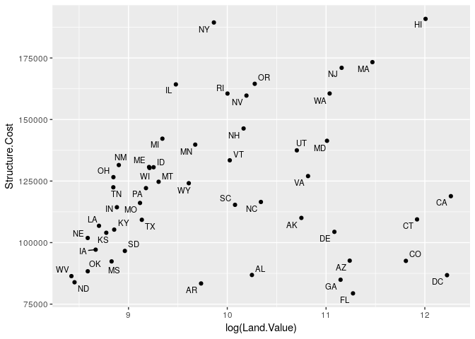

    p1 +
      geom_point(aes(size = 2),
                 color="red") 

    p1 +
      geom_point(aes(color=Home.Value, shape = region))

    ## Warning: Removed 1 rows containing missing values (geom_point).

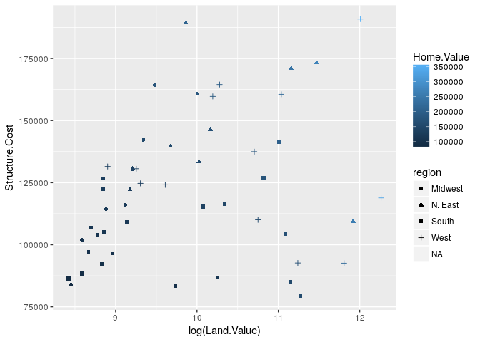

    # EXERCISE 1
    library(ggplot2)
    dat <- read.csv("/home/eeb177-student/Desktop/eeb-177/lab-work/exercise-8/Rgraphics/dataSets/EconomistData.csv")
    head(dat)

    ##   X     Country HDI.Rank   HDI CPI            Region
    ## 1 1 Afghanistan      172 0.398 1.5      Asia Pacific
    ## 2 2     Albania       70 0.739 3.1 East EU Cemt Asia
    ## 3 3     Algeria       96 0.698 2.9              MENA
    ## 4 4      Angola      148 0.486 2.0               SSA
    ## 5 5   Argentina       45 0.797 3.0          Americas
    ## 6 6     Armenia       86 0.716 2.6 East EU Cemt Asia

    plot1 <- ggplot(dat, aes(x = CPI, y = HDI))
    plot1 + geom_point(aes(color = Region, size = HDI.Rank))

    args(geom_histogram)

    ## function (mapping = NULL, data = NULL, stat = "bin", position = "stack", 
    ##     ..., binwidth = NULL, bins = NULL, na.rm = FALSE, show.legend = NA, 
    ##     inherit.aes = TRUE) 
    ## NULL

    args(stat_bin)

    ## function (mapping = NULL, data = NULL, geom = "bar", position = "stack", 
    ##     ..., binwidth = NULL, bins = NULL, center = NULL, boundary = NULL, 
    ##     breaks = NULL, closed = c("right", "left"), pad = FALSE, 
    ##     na.rm = FALSE, show.legend = NA, inherit.aes = TRUE) 
    ## NULL

    p2 <- ggplot(housing, aes(x = Home.Value))
    p2 + geom_histogram()

    ## `stat_bin()` using `bins = 30`. Pick better value with `binwidth`.

    p2 + geom_histogram(stat = "bin", binwidth=4000)

    housing.sum <- aggregate(housing["Home.Value"], housing["State"], FUN=mean)
    rbind(head(housing.sum), tail(housing.sum))

    ##    State Home.Value
    ## 1     AK  147385.14
    ## 2     AL   92545.22
    ## 3     AR   82076.84
    ## 4     AZ  140755.59
    ## 5     CA  282808.08
    ## 6     CO  158175.99
    ## 46    VA  155391.44
    ## 47    VT  132394.60
    ## 48    WA  178522.58
    ## 49    WI  108359.45
    ## 50    WV   77161.71
    ## 51    WY  122897.25

    ggplot(housing.sum, aes(x=State, y=Home.Value)) + 
      geom_bar(stat="identity")

    #EXERCISE 2
    library(ggplot2)
    dat <- read.csv("/home/eeb177-student/Desktop/eeb-177/lab-work/exercise-8/Rgraphics/dataSets/EconomistData.csv")
    head(dat)

    ##   X     Country HDI.Rank   HDI CPI            Region
    ## 1 1 Afghanistan      172 0.398 1.5      Asia Pacific
    ## 2 2     Albania       70 0.739 3.1 East EU Cemt Asia
    ## 3 3     Algeria       96 0.698 2.9              MENA
    ## 4 4      Angola      148 0.486 2.0               SSA
    ## 5 5   Argentina       45 0.797 3.0          Americas
    ## 6 6     Armenia       86 0.716 2.6 East EU Cemt Asia

    ggplot(dat, aes(x = CPI, y = HDI)) +
      geom_point() +
      geom_smooth(method = "lm")

    #EXERCISE 2 cont

    ggplot(dat, aes(x = CPI, y = HDI)) +
      geom_point() +
      geom_line(stat = "smooth", method = "loess")

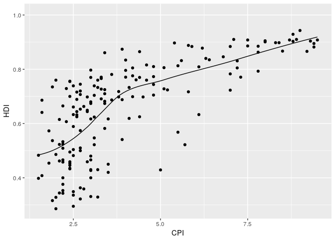

    #EXERCISE 2 Bonus

    ggplot(dat, aes(x = CPI, y = HDI)) +
      geom_point() +
      geom_smooth(span = .4)

    ## `geom_smooth()` using method = 'loess'

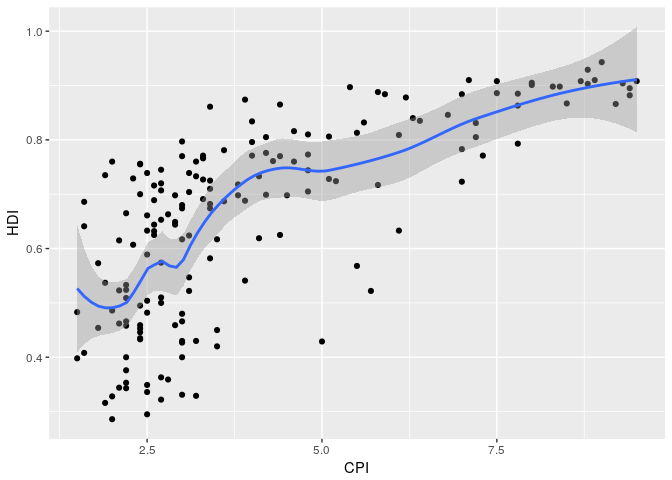

    p3 <- ggplot(housing,
                 aes(x = State,
                     y = Home.Price.Index)) + 
            theme(legend.position="top",
                  axis.text=element_text(size = 6))
    (p4 <- p3 + geom_point(aes(color = Date),
                           alpha = 0.5,
                           size = 1.5,
                           position = position_jitter(width = 0.25, height = 0)))

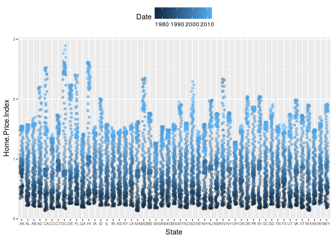

    p4 + scale_x_discrete(name="State Abbreviation") +
      scale_color_continuous(name="",
                             breaks = c(1976, 1994, 2013),
                             labels = c("'76", "'94", "'13"))

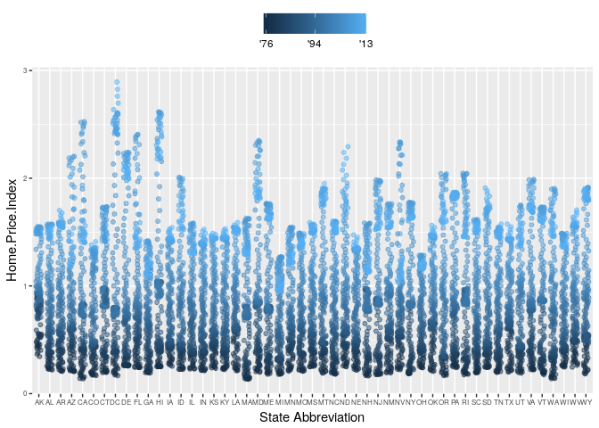

    p4 +
      scale_x_discrete(name="State Abbreviation") +
      scale_color_continuous(name="",
                             breaks = c(1976, 1994, 2013),
                             labels = c("'76", "'94", "'13"),
                             low = "blue", high = "red")

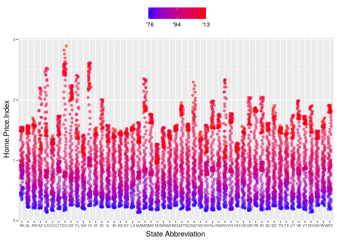

    p4 +
      scale_color_continuous(name="",
                             breaks = c(1976, 1994, 2013),
                             labels = c("'76", "'94", "'13"),
                             low = "blue", high = "red")

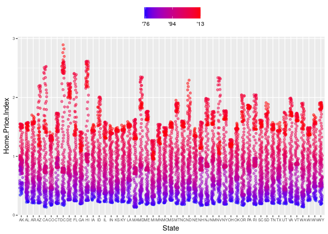

    p4 +
      scale_color_gradient2(name="",
                            breaks = c(1976, 1994, 2013),
                            labels = c("'76", "'94", "'13"),
                            low = "blue",
                            high = "red",
                            mid = "gray60",
                            midpoint = 1994)

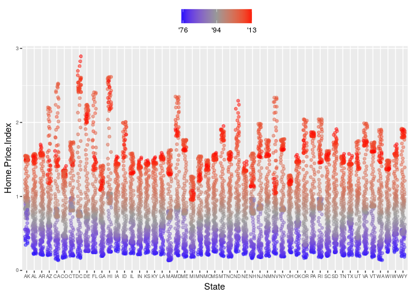

    #EXERCISE 3

    ggplot(dat, aes(x = CPI, y = HDI, color = "Region")) +
    geom_point() +
    scale_x_continuous(name = "Corruption Perception Index") +
    scale_y_continuous(name = "Human Development Index") +
      scale_color_manual(name = "Region of the world",
                         values = c("red"))

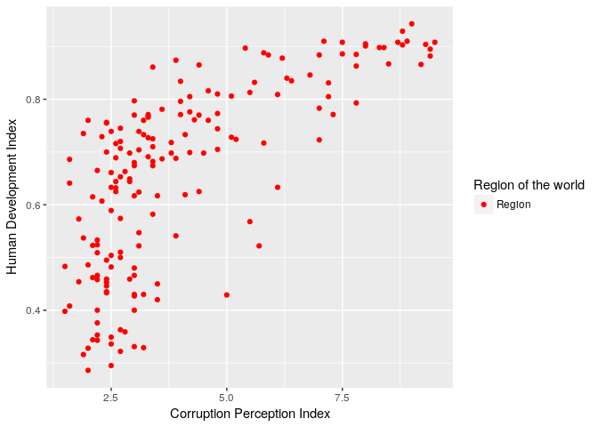

    p5 <- ggplot(housing, aes(x = Date, y = Home.Value))
    p5 + geom_line(aes(color = State))

    (p5 <- p5 + geom_line() +
       facet_wrap(~State, ncol = 10))

    p5 + theme_linedraw()

    p5 + theme_light()

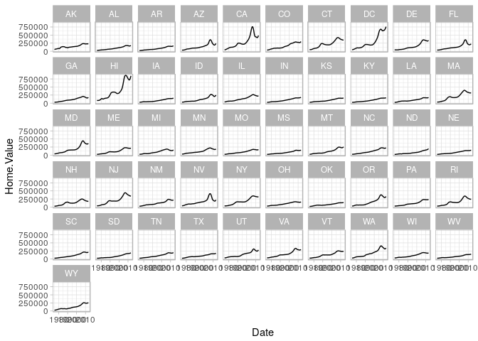

    p5 + theme_minimal() +
      theme(text = element_text(color = "turquoise"))

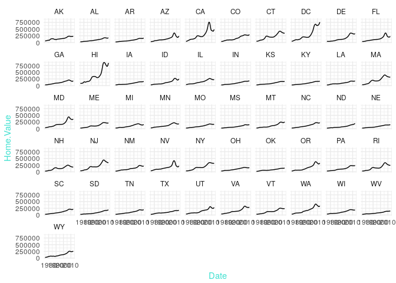

    theme_new <- theme_bw() +
      theme(plot.background = element_rect(size = 1, color = "blue", fill = "black"),
            text=element_text(size = 12, family = "Serif", color = "ivory"),
            axis.text.y = element_text(colour = "purple"),
            axis.text.x = element_text(colour = "red"),
            panel.background = element_rect(fill = "pink"),
            strip.background = element_rect(fill = "orange"))

    p5 + theme_new

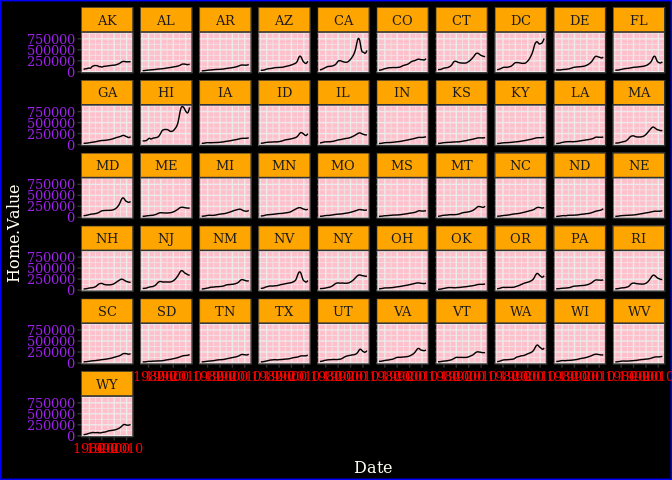

    housing.byyear <- aggregate(cbind(Home.Value, Land.Value) ~ Date, data = housing, mean)
    ggplot(housing.byyear,
           aes(x=Date)) +
      geom_line(aes(y=Home.Value), color="red") +
      geom_line(aes(y=Land.Value), color="blue")

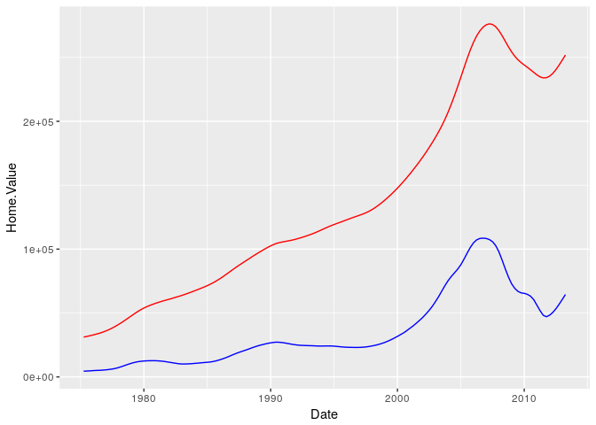

    library(tidyr)
    home.land.byyear <- gather(housing.byyear,
                               value = "value",
                               key = "type",
                               Home.Value, Land.Value)
    ggplot(home.land.byyear,
           aes(x=Date,
               y=value,
               color=type)) +
      geom_line()

    dat <- read.csv("/home/eeb177-student/Desktop/eeb-177/lab-work/exercise-8/Rgraphics/dataSets/EconomistData.csv")

    #building inital plot
    pc1 <- ggplot(dat, aes(x = CPI, y = HDI, color = Region))
    pc1 + geom_point()

    # adding in the trendline
    (pc2 <- pc1 +
       geom_smooth(aes(group = 1),
                   method = "lm",
                   formula = y ~ log(x),
                   se = FALSE,
                   color = "red")) +
       geom_point()

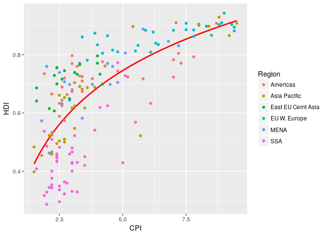

    # making adjustments
    pc2 +
      geom_point(shape = 1, size = 4)

    (pc3 <- pc2 + geom_point(shape = 1, size = 2.5, stroke = 1.25))

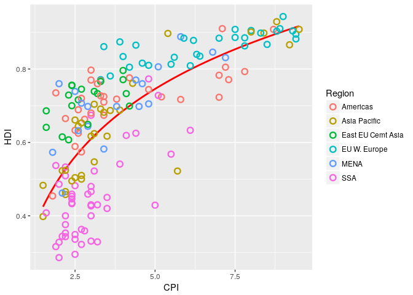

    #labelling hte points on the graph
    pointsToLabel <- c("Russia", "Venezuela", "Iraq", "Myanmar", "Sudan",
                       "Afghanistan", "Congo", "Greece", "Argentina", "Brazil",
                       "India", "Italy", "China", "South Africa", "Spane",
                       "Botswana", "Cape Verde", "Bhutan", "Rwanda", "France",
                       "United States", "Germany", "Britain", "Barbados", "Norway", "Japan",
                       "New Zealand", "Singapore")

    (pc4 <- pc3 +
      geom_text(aes(label = Country),
                color = "gray20",
                data = subset(dat, Country %in% pointsToLabel)))

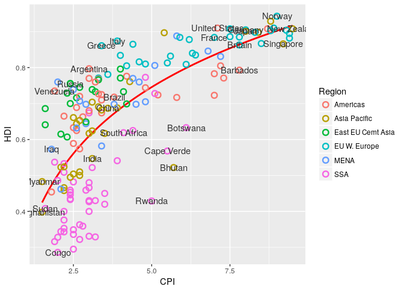

    library("ggrepel")
    (pc4 <- pc3 +
       geom_text_repel(aes(label = Country),
                       color = "gray20",
                       data = subset(dat, Country %in% pointsToLabel),
                       force = 10))

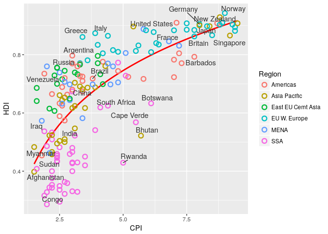

    #labelling the countries, etc.
    dat$Region <- factor(dat$Region,
                         levels = c("EU W. Europe",
                                    "Americas",
                                    "Asia Pacific",
                                    "East EU Cemt Asia",
                                    "MENA",
                                    "SSA"),
                         labels = c("OECD",
                                    "Americas",
                                    "Asia &\nOceania",
                                    "Central &\nEastern Europe",
                                    "Middle East &\nnorth Africa",
                                    "Sub-Saharan\nAfrica"))
    pc4$data <- dat
    pc4

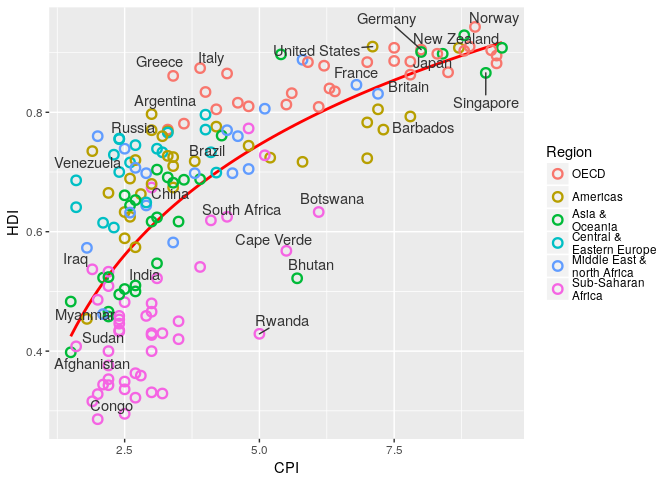

    # labelling the axes and sizing them and changing the colors for eac country to match as closely to the real graph
    # found a pdf online of all colors in Rstudio and picked the ones that looked the best
    library(grid)
    (pc5 <- pc4 +
      scale_x_continuous(name = "Corruption Perceptions Index, 2011 (10=least corrupt)",
                         limits = c(.9, 10.5),
                         breaks = 1:10) +
      scale_y_continuous(name = "Human Development Index, 2011 (1=Best)",
                         limits = c(0.2, 1.0),
                         breaks = seq(0.2, 1.0, by = 0.1)) +
      scale_color_manual(name = "",
                         values = c("deepskyblue4",
                                    "deepskyblue3",
                                    "deepskyblue2",
                                    "darkcyan",
                                    "brown3",
                                    "brown4")) +
      ggtitle("Corruption and Human development"))

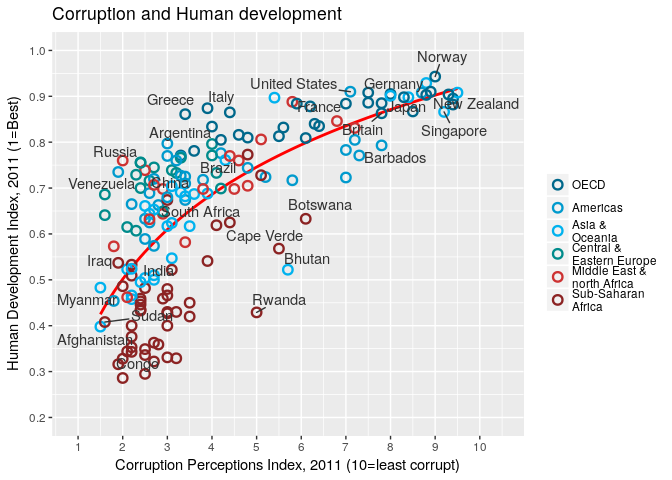

    #making final tweaks to aesthetics
    library(grid) 
    (pc6 <- pc5 +
      theme_minimal() + 
      theme(text = element_text(color = "gray20"),
            legend.position = c("top"),  
            legend.direction = "horizontal",
            legend.justification = 0.1, 
            legend.text = element_text(size = 11, color = "gray10"),
            axis.text = element_text(face = "italic"),
            axis.title.x = element_text(vjust = -1), 
            axis.title.y = element_text(vjust = 2), 
            axis.ticks.y = element_blank(), 
            axis.line = element_line(color = "gray40", size = 0.5),
            axis.line.y = element_blank(),
            panel.grid.major = element_line(color = "gray50", size = 0.5),
            panel.grid.major.x = element_blank()
            ))

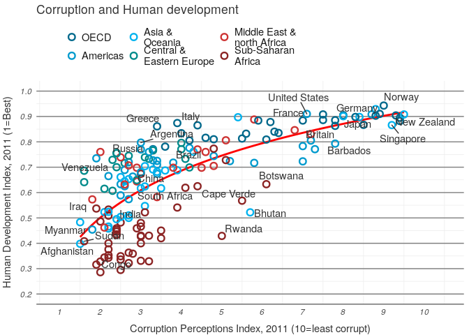

    # the last part would be to make the calculation and add it to the graph however I'm not quite sure how to do this part or how to add to graph.
